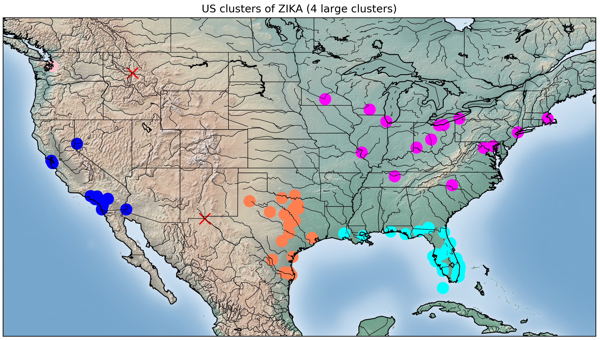

# Discovering Disease Outbreaks

In this project, a curated list of 2016 headlines are examined for location information (city, country) and disease reports. The locations are plotted and then grouped (Kmeans, DBSCAN) to examine possible outbreak clusters.

#### Jamie Shaffer, April 2020

- [Data Collection](#Data-Collection)
- [Outbreak Summary](#Outbreak-Summary)
- [Resources](#Resources)

# Data Collection
Data for this project consisted of a curated list of 650 newspaper headlines from around the world. Only headlines that contained geographical information, such as city or country name, were included.

From these, the location names were extracted and matched to geographical coordinates (lat, long). Finally, the diseases were grouped into clusters using machine learning classification methods (k-means, DBSCAN), and plotted for analysis.

# Outbreak Summary

In this list of 2016 headlines, the disease with the most clusters was Zika. From https://www.cdc.gov/zika/about/index.html:

"Zika is spread mostly by the bite of an infected Aedes species mosquito (Ae. aegypti and Ae. albopictus). These mosquitoes bite during the day and night. Zika can be passed from a pregnant woman to her fetus. Infection during pregnancy can cause certain birth defects. There is no vaccine or medicine for Zika."

Based on headlines alone, there were 5 large world clusters:    
 - North America - Central America - South America (west coast)
 - South America (east coast)
 - Southern Europe (Spain)
 - South Asia
 - Oceania (Australia east coast)

Isolated reports were designated with a red X.

|World clusters of ZIKA (2016)|
|---|
||

Taking a closer look at the United states, there were 4 large clusters:       
 - West Coast (California) - which may be contiguous with cases on the west coast of Mexico    
 - Gulf Coast (Texas) - which may be contiguous with cases on the east coast of Mexico    
 - Gulf States (Louisiana, Mississippi, Alabama, Florida, Georgia)    
 - Upper Midwest to Atlantic    

| US cluster of ZIKA (2016)|
|---|
||

From https://www.cdc.gov/zika/vector/range.html: The habitat of the Ae. aegypti and Ae. albopicus mosquitos includes coastal and temperate regions of the US. The following 2017 maps of the suspected habitat align with the US cases, although the **ZIKA cases imply that the habitat of these mosquitos may be expanding north and inland following the paths of rivers.**

|CDC map of mosquito ranges in the U.S. (2017)|
|---|
||

# Resources
This project is based on one of the case studies in "Data Science Bookcamp" by Manning Publications.

Note to students: Learning from other portfolios and projects is a smart choice! Plagiarism is, however, a very poor choice. Please credit your sources, and, as much as possible, explore and modify the code to make it your own. If you are working through a similar project on the Manning platform, please contact me there for project questions.

[Link to my updated portfolio](https://jshaffer94247.github.io/)
